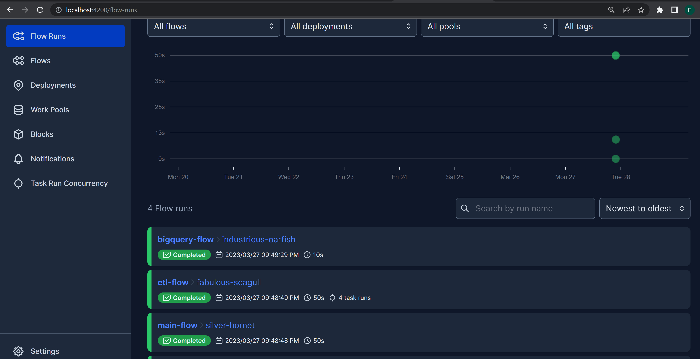

# tfl-data-project

[Dashboard](https://public.tableau.com/views/dbtnewb/Dashboard2?:language=en-US&:display_count=n&:origin=viz_share_link)&ensp; &ensp;&ensp;&ensp;&ensp;	[Ingestion_Script](https://github.com/fxboakye/tfl-data-project/blob/master/flows/gcs_ingestion.py)&ensp; &ensp;&ensp;&ensp;&ensp; [dbt Models](https://github.com/fxboakye/tfl-data-project/tree/master/tfl_data_dbt/models)

### TECH STACK USED
* Python
* Prefect
* dbt
* Bigquery
* Docker

This project is a robust solution that automates the extraction of bicycle trip record datasets from the [Transport for London Website](https://www.nyc.gov/site/tlc/about/tlc-trip-record-data.page), leveraging the power of docker. By simply providing month and year values, the pipeline retrieves the necessary data and processes it into a convenient parquet file format. Due to the non-uniformity of each dataset link, the pipeline utilizes regex to parse through the website's links and extracts the required datasets for each specified month and year.

The ingestion script has been thoughtfully designed to address a common problem encountered in data management - avoiding duplicates. To prevent this, the script has been programmed to ingest data to Google Cloud Storage (GCS) ***only*** if the data is not already present in the data lake. This guarantees that there are no redundant or duplicate entries in the data lake.

After the data has been successfully saved into the GCS bucket and inserted into the corresponding table in the BigQuery database, additional measures were taken to ensure the integrity of the dataset. This was achieved by leveraging the powerful data transformation capabilities of dbt.

With dbt, essential data operations, including data modeling, testing, and documentation, were incorporated into the data management pipeline. This facilitated the process of ensuring that the data is consistent and accurate, and is suitable for downstream analysis.

Following the successful transformation and verification of the data, it was then saved into a designated warehouse for easy storage and retrieval. At this stage, the data warehouse was then used to create a dynamic dashboard that provides a comprehensive overview of key trends and patterns. Through the dashboard, users can quickly identify important insights such as peak months and peak hours of bike demands, which can be useful for making informed decisions related to bike-sharing services or urban transportation planning. 


## Steps to Reproduce

* Clone Repository

## Getting Started

### Setting up Prefect and Running flow codes
There are 2 directories in this repository. The flows directory contains the python scripts and bash scripts required to run the ingestion.

### Setting up Prefect Orion server

To run the prefect server, open a terminal, in the parent directory run:

```
docker-compose --profile orion up
```

This will start the prefect orion server which should look like:

```cmd
orion  |  ___ ___ ___ ___ ___ ___ _____    ___  ___ ___ ___  _  _
orion  | | _ \ _ \ __| __| __/ __|_   _|  / _ \| _ \_ _/ _ \| \| |
orion  | |  _/   / _|| _|| _| (__  | |   | (_) |   /| | (_) | .` |
orion  | |_| |_|_\___|_| |___\___| |_|    \___/|_|_\___\___/|_|\_|
orion  |
orion  | Configure Prefect to communicate with the server with:
orion  |
orion  |     prefect config set PREFECT_API_URL=http://0.0.0.0:4200/api
orion  |
orion  | View the API reference documentation at http://0.0.0.0:4200/docs
orion  |
orion  | Check out the dashboard at http://0.0.0.0:4200

```

Then on your computer navigate to `http://localhost:4200/` to view the workflow ui. At this point there will be no flow runs since no scripts have been executed.

### Executing the ingestion script

To execute the ingestion script, open a terminal and run:

```
docker-compose run cli
```
This will install all the required modules and execute the `gcs_ingestion.py` script in the flows directory. The gcs script calls the biquery-flow.py script
which writes data from the data lake to bigquery. Navigate to `http://localhost:4200/` to view the workflow UI. At this point, you should see the flow runs. An example is shown below:

<p align="center">
  
</p>

### Running dbt models
- Create `profiles.yml` file in `~/.dbt/` in your local machine or add the following code in your existing `profiles.yml` - 
  ```yaml
  tfl_data_dbt:
    outputs:
      dev:
        dataset: <bigquery-dataset>
        fixed_retries: 1
        keyfile: /.google/credentials/google_credentials.json
        location: US
        method: service-account
        priority: interactive
        project: <gcp-project-id>
        threads: 4
        timeout_seconds: 300
        type: bigquery
    target: dev
  ```
  - Replace with your `dataset`, `location` (my GCS bucket is in `US` region, change to `EU` if needed), `project` values.

You would then need to build the dbt image by running:
```
docker build .
```

Check if dbt-bigquery connection is ok by running:
```
docker compose run --workdir="//usr/app/dbt/tfl_data_dbt" dbt debug
```

To execute the dbt transformation models on the dataset,  you would need to run:

```
docker compose run --workdir="//usr/app/dbt/tfl_data_dbt" dbt run
```
